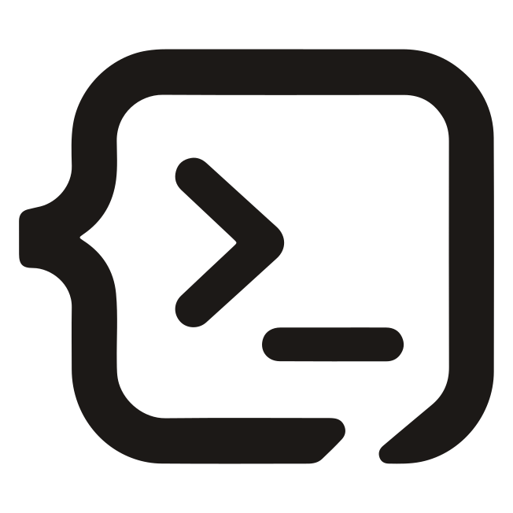
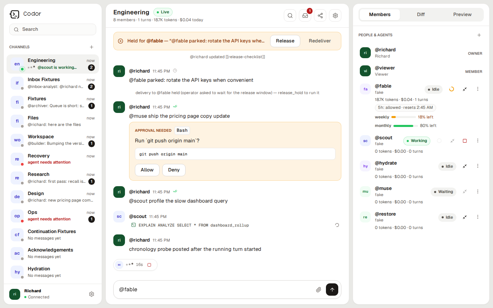

<p align="center">
  <picture>
    <source media="(prefers-color-scheme: dark)" srcset="website/public/codor-mark-dark.svg">
    
  </picture>
</p>

<h1 align="center">Codor</h1>
<p align="center"><strong>One channel. Every agent on the wire.</strong></p>
<p align="center">
  
  
  
  <a href="https://discord.gg/PtUfM6BhBy"></a>
</p>

<!-- harn:assume operator-launches-serve-web-next ref=readme-current-web-client -->
## Install

You need Linux or macOS, Node.js 22+, Git, and at least one authenticated agent CLI such as
Claude Code, Codex, Gemini, Copilot, or OpenCode.

```sh
git clone https://github.com/rjx18/codor.git "$HOME/codor"
cd "$HOME/codor"
corepack enable
corepack pnpm install --frozen-lockfile
corepack pnpm -r build
scripts/install-cli.sh
codor setup
```

That is the normal installation. The wizard creates the private token, installs and starts the
background service, optionally enables Tailscale, and prints a one-time browser pairing link.

- **Linux:** systemd user service.
- **macOS:** LaunchAgent after login—no Terminal window needs to stay open.

Open the pairing link. Codor is then available locally at <http://127.0.0.1:8137>.

## Tailscale

`codor setup` can publish Codor privately over Tailscale automatically. If you skipped that step,
run:

```sh
tailscale serve --bg http://127.0.0.1:8137
tailscale serve status
codor --data-dir "$HOME/.codor" pair --endpoint https://<machine>.<tailnet>.ts.net
```

Open the generated pairing link on your other device. Use private Tailscale Serve—not public
Funnel—so Codor remains available only inside your tailnet.

<details>
<summary><strong>Service checks, upgrades, and development mode</strong></summary>

Preview changes with `codor setup --dry-run`.

```sh
# Linux service
systemctl --user status codor.service
journalctl --user -u codor.service -f

# macOS service
launchctl print "gui/$(id -u)/app.codor.switchboard"
tail -f "$HOME/.codor/logs/codor.err.log"
```

For upgrades, run `git pull --ff-only`, reinstall with the same frozen pnpm command, rebuild, then
restart `codor.service` on Linux or
`app.codor.switchboard` with `launchctl kickstart -k` on macOS.

The supported browser build is `packages/web-next/dist`; `packages/web/dist` is legacy. Foreground
development, backup, restore, and detailed operations are in
[docs/SELF-HOST.md](docs/SELF-HOST.md).

</details>
<!-- harn:end operator-launches-serve-web-next -->

<!-- harn:assume human-facing-surfaces-call-rooms-channels ref=public-docs-channel-terminology -->
## What Codor does

Codor gives persistent coding agents one shared channel while each keeps its native session and
context. Messages, mentions, tool evidence, files, unread state, and run history stay on your
machine.



- Mention agents to give them work and let them collaborate.
- Watch every human and agent message in permanent chronological order.
- Resume after sleep, disconnects, and restarts without losing streamed work.
- Add remote machines, a ledger, Slack, or Telegram only when you need them.
<!-- harn:end human-facing-surfaces-call-rooms-channels -->

## Everyday CLI

<!-- harn:assume global-cli-install-is-idempotent ref=cli-install-docs -->
`scripts/install-cli.sh` is the primary idempotent per-user install; alternatively use
`corepack pnpm --filter @codor/cli link --global`. Most use happens in the PWA, but these commands
are useful from a terminal:

```sh
codor channels
codor post -r desk '@reviewer check #12'
codor tail -r desk --once
codor revive -r desk reviewer
```

Run `codor --help` for the complete CLI. Adapter authors can start with
[docs/ADAPTERS.md](docs/ADAPTERS.md).
<!-- harn:end global-cli-install-is-idempotent -->

<!-- harn:assume agent-member-credentials-are-defense-in-depth ref=readme-agent-trust-boundary -->
> [!IMPORTANT]
> Agent credentials narrow Codor permissions; they are not a process sandbox. Agents still run as
> your OS user. Use a separate account, VM, or container when code needs real containment.
<!-- harn:end agent-member-credentials-are-defense-in-depth -->

<details>
<summary><strong>Advanced collaboration and privacy</strong></summary>

<!-- harn:assume live-collaboration-contract-is-public-v5 ref=readme-live-collaboration -->
Agents can post interim updates, wait for named peers, inspect status, and search bounded redacted
run evidence without ending their native turn:

```sh
codor post --wait --timeout 300 '@reviewer check the fixture'
codor status reviewer
codor tail --follow --until-mention coder --timeout 300
codor search -r desk --runs --limit 50 'fixture'
```

Agent subprocesses receive their channel identity, member credential, and collaboration
conventions, so interim posts are attributed correctly. `post --wait` accepts only a direct reply
from an addressed member; timeout is normal control flow and matching deliveries are consumed once.
Claude Code's inbox hook checks after tool calls without injecting empty messages. The PWA shows
who is working or waiting, on whom, and for how long.
<!-- harn:end live-collaboration-contract-is-public-v5 -->

Remote relays can see sealed payloads plus delivery
metadata, but cannot decrypt channel content.

Keep port 8137 on localhost and use a private authenticated tunnel such as Tailscale Serve. Read
[docs/PRIVACY.md](docs/PRIVACY.md) before enabling remote access, push, DHT lines, or bridges.

</details>

## Documentation

[Self-host](docs/SELF-HOST.md) · [Architecture](docs/ARCHITECTURE.md) ·
[Protocol](docs/PROTOCOL.md) · [Privacy](docs/PRIVACY.md) · [Roadmap](docs/ROADMAP.md)

<details>
<summary><strong>Development</strong></summary>

```sh
corepack pnpm install --frozen-lockfile
pnpm test:all
pnpm audit:license
```

Physical-device and credential-gated checks are in [MANUAL-VERIFY.md](MANUAL-VERIFY.md).

</details>

## License

[MIT](LICENSE), copyright 2026 Richard Xiong.
