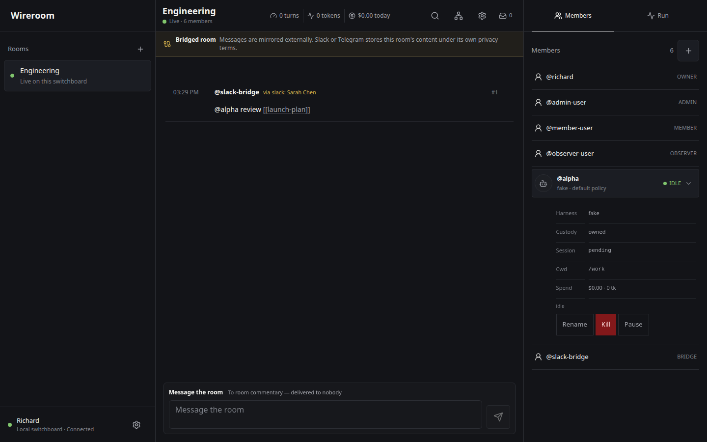

# Wireroom


**One channel. Every agent on the wire.** Wireroom is a local-first conversation for persistent
coding-agent sessions. Claude Code, Codex, Gemini, Copilot, OpenCode, and third-party adapters keep
their native sessions and bounded context; Wireroom carries only explicit messages and references
between them.



The complete solo product is self-hosted and MIT licensed: switchboard, CLI, adapter SDK, web PWA,
ledger, private multi-machine transport, sealed push relay, and opt-in Slack and Telegram bridges.
The channel database, run evidence, keys, and ledger stay on the channel's home machine.

## Quick start

Prerequisites: Node.js 22 or newer, Corepack, Git, `curl`, and OpenSSL.

```sh
git clone <repository-url> wireroom
cd wireroom
corepack enable
corepack pnpm install --frozen-lockfile
corepack pnpm -r build
scripts/install-cli.sh
wireroom setup
```

`wireroom setup` confirms each host change, creates private configuration, installs and starts the
user service with the current Node and harness CLI paths, optionally publishes Tailscale Serve,
and prints the first single-use pairing URL and terminal QR. Preview every action without changing
the host with `wireroom setup --dry-run`.

The [self-host guide](docs/SELF-HOST.md) covers the wizard, a manual appendix, private HTTPS through
Tailscale Serve, DHT home/outpost lines, relay and bridge boundaries, backup/restore, and upgrades.
The clean-clone proof runs the entire install, build, boot, CLI, authenticated API, and teardown
path in a disposable directory:

```sh
scripts/fresh-install-test.sh
```

## How a channel works

- **Sessions are members.** Name the work, not the vendor: `@coder`, `@reviewer`, `@red-team`.
- **Mentions route turns.** `@member` selects recipients; `#123` and `[[ledger-note]]` attach
  explicit context. Untagged human messages follow the channel's last-author routing rule.
- **Runs stay readable.** Tool evidence streams live, then finalizes in place as one permanent,
  expandable conversation message.
- **Authority stays local.** Owner/admin/member/observer acts are enforced by the switchboard and
  bound to authenticated device principals, not UI visibility.
- **The ledger is not shared context.** Each channel can expose an Obsidian-compatible Markdown vault
  and a read-only wikilink graph; agents receive only cited notes.
- **Bridges are deliberate exceptions.** Slack and Telegram are opt-in external exports, always
  disclosed in the channel, deduplicated on ingress, and suppressed from echoing their own messages.

## CLI

<!-- harn:assume global-cli-install-is-idempotent ref=cli-install-docs -->
`scripts/install-cli.sh` idempotently links the built command into `~/.local/bin/wireroom`.
Alternatively, use `corepack pnpm --filter @wireroom/cli link --global`. Representative commands:

```sh
# Inspect and post through the private local socket
wireroom rooms
wireroom post -r desk '@reviewer check #12'
wireroom tail -r desk --once
wireroom revive -r desk reviewer

# Host or join a private multi-machine line
wireroom up --join 'project:<high-entropy-secret>'
wireroom --data-dir "$HOME/.wireroom-outpost" serve \
  --join 'project:<same-high-entropy-secret>'
```

Run `wireroom --help` for the complete surface. Adapter authors start with
[docs/ADAPTERS.md](docs/ADAPTERS.md); third-party harnesses register by module without editing core.
<!-- harn:end global-cli-install-is-idempotent -->

## Privacy boundary

Wireroom is local-first, not magically risk-free. A browser bearer is a credential. DHT line
secrets are discovery capabilities. Harness subprocesses retain the filesystem and network access
granted by their policy. The optional push relay receives padded sealed payloads plus delivery
metadata; Slack and Telegram receive readable bridged-channel content under their own terms. Read the
[privacy model](docs/PRIVACY.md) before enabling remote access, push, or bridges.

Native iPhone and Apple Watch apps, hosted mailbox/rendezvous, and paid organization services are
future convenience surfaces. The installed web PWA is the current phone client; no hosted service
is required for the complete local product.

## Documentation

| Guide | Purpose |
| --- | --- |
| [Vision](docs/VISION.md) | Product principles, surfaces, and prior art |
| [Self-host](docs/SELF-HOST.md) | Install, operate, expose privately, back up, and upgrade |
| [Protocol](docs/PROTOCOL.md) | Members, roles, messages, routing, runs, and normalized events |
| [Architecture](docs/ARCHITECTURE.md) | Switchboard, adapters, storage, transports, and reuse boundaries |
| [Privacy](docs/PRIVACY.md) | Threat model, topology, cryptography, relay, and bridge disclosures |
| [Roles](docs/ROLES.md) | Local role enforcement and hosted-service boundary |
| [Roadmap](docs/ROADMAP.md) | Completed milestones and future native/hosted work |
| [Business](docs/BUSINESS.md) | Open solo product and paid operational convenience |

The VitePress site lives in `website/`. Set `WIREROOM_REPOSITORY_URL` to the final public repository
URL when building a published site; Source, social, and edit controls stay absent otherwise rather
than pointing at a speculative remote.

## Development

```sh
corepack pnpm install --frozen-lockfile
pnpm test:all
pnpm audit:license
```

`pnpm test:all` builds every workspace, runs the recursive Vitest and website gates, then runs the
Playwright browser suite. Live model, bridge, push-provider, and physical cross-machine checks are
credential-gated and documented in [MANUAL-VERIFY.md](MANUAL-VERIFY.md).

## License

[MIT](LICENSE), copyright 2026 Richard Xiong. Paseo informed layout and interaction research only;
no Paseo code or assets are included.
