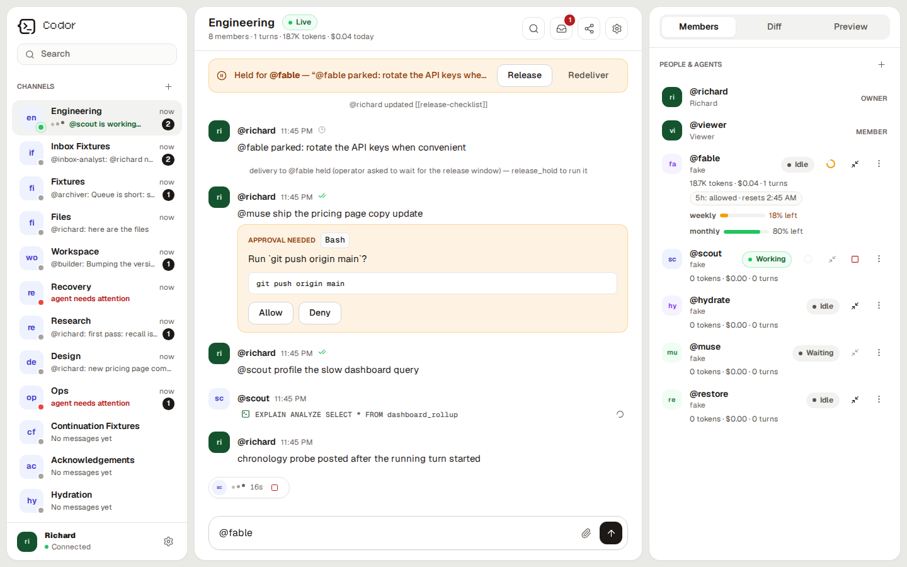

<!-- harn:assume public-package-readme-renders-on-npm ref=readme-registry-logo -->
<p align="center">
  <picture>
    <source media="(prefers-color-scheme: dark)" srcset="https://raw.githubusercontent.com/rjx18/codor/main/website/public/codor-mark-dark.svg">
    
  </picture>
</p>
<!-- harn:end public-package-readme-renders-on-npm -->

<h1 align="center">Codor</h1>
<p align="center"><strong>One channel. Every agent on the wire.</strong></p>
<p align="center">
  
  
  
  <a href="https://discord.gg/PtUfM6BhBy"></a>
</p>

> [!WARNING]
> **Codor is currently in alpha and still under active development.** Expect some features to be
> broken or unfinished, along with frequent updates.

<!-- harn:assume operator-launches-serve-web-next ref=readme-current-web-client -->
<!-- harn:assume public-npx-install-is-primary-install ref=readme-primary-install -->
## Install

Install and configure Codor in one command (Node.js 22.12.0 or newer):

```sh
npx @richhardry/codor install
```

The interactive setup checks this computer, prepares private files, asks how the browser should
connect, starts Codor, verifies the daemon, and prints a QR, URL, eight-character pairing code, and
expiry. It never sends channel data through a Codor-hosted service.

<!-- harn:assume pnpm-install-docs-disclose-build-approval-boundaries ref=readme-pnpm-install-disclosure -->
> [!NOTE]
> On pnpm, install into a project rather than running `pnpm dlx @richhardry/codor install`. A tested
> `pnpm dlx` install did not pick up the workspace `packageExtensions` and native build-approval
> settings this install needs—see [Self-host: Prerequisites](docs/SELF-HOST.md#prerequisites) for
> the settings.
<!-- harn:end pnpm-install-docs-disclose-build-approval-boundaries -->

Preview without changing the host:

```sh
npx @richhardry/codor install --dry-run
```

For unattended setup, approve mutation and choose exposure explicitly:

```sh
npx @richhardry/codor install --yes --access localhost
# or: --access tailscale
```

`npx @richhardry/codor setup` remains available as a backward-compatible alias.

- **Linux:** systemd user service.
- **macOS:** LaunchAgent after login—no Terminal window needs to stay open.

<!-- harn:assume windows-setup-installs-private-task-service ref=readme-native-windows-service -->
- **Windows (native):** hidden per-user Task Scheduler service—no WSL or open terminal required.
<!-- harn:end windows-setup-installs-private-task-service -->

<!-- harn:assume wsl-setup-keeps-private-windows-loopback ref=readme-wsl-access -->
**Windows with WSL2:** run setup inside WSL, then open the same `http://127.0.0.1:8137`
address in your Windows browser.
<!-- harn:end wsl-setup-keeps-private-windows-loopback -->

Open the pairing link. Codor is then available locally at <http://127.0.0.1:8137>.

To install the first updater release, or to update on native Windows, run:

```sh
npx --yes --package=@richhardry/codor@latest codor update
```

After that first bootstrap, Linux and macOS can use the durable launcher directly:

```sh
codor update
```

Native Windows setup does not install a persistent command launcher yet, so continue using the
exact npx command there. Updates preserve Codor data and verify the selected service generation;
no manual restart is required.
<!-- harn:end public-npx-install-is-primary-install -->

<details>
<summary><strong>First time? Install prerequisites</strong></summary>

You need Node.js 22.12.0 or newer and one authenticated agent CLI. Git and pnpm are needed only
for source development.

**macOS**

```sh
xcode-select --install
/bin/bash -c "$(curl -fsSL https://raw.githubusercontent.com/Homebrew/install/HEAD/install.sh)"
brew install git node pnpm
```

**Ubuntu / Debian**

```sh
sudo apt update
sudo apt install -y git curl
curl https://get.volta.sh | bash
```

Open a new terminal, then run:

```sh
volta install node@22.12.0
npm install -g pnpm@10.9.0
```

**Windows** (PowerShell)

```powershell
winget install Git.Git OpenJS.NodeJS.LTS
npm install -g pnpm@10.9.0
```

Install and sign in to at least one supported agent:
[Claude Code](https://docs.anthropic.com/en/docs/claude-code/getting-started),
[Codex](https://github.com/openai/codex),
[Cursor](https://cursor.com/cli),
[Antigravity](https://antigravity.google/docs/cli/getting-started) (`agy`),
[Gemini](https://github.com/google-gemini/gemini-cli),
[Grok Build](https://docs.x.ai/build/cli/headless-scripting),
[Copilot](https://docs.github.com/en/copilot/how-tos/copilot-cli/cli-getting-started), or
[OpenCode](https://opencode.ai/docs/).

</details>

## Access remotely with Tailscale

Tailscale lets you open Codor privately from your phone, tablet, or another computer—without
putting it on the public internet. [Install Tailscale](https://tailscale.com/download) and sign in
on both devices with the same account.

<!-- harn:assume tailscale-serve-docs-disclose-certificate-transparency ref=readme-tailscale-certificate-disclosure -->
> [!IMPORTANT]
> Before this works, HTTPS certificates must be enabled for your tailnet at
> [the admin console](https://console.tailscale.com/admin/dns). Until then, `tailscale serve` waits
> for you to complete that setup in a browser instead of returning—if `codor install` looks frozen
> at "configuring Tailscale", this is why. Enabling HTTPS only authorizes certificate issuance;
> running `tailscale serve` (as `codor install` does) then issues one, which publishes this
> machine's `*.ts.net` name to the public
> [Certificate Transparency](https://tailscale.com/docs/how-to/set-up-https-certificates) log—a
> disclosure that can't be undone, even if you disable HTTPS again later. If you'd rather skip this,
> choose "On this computer only" during setup—you can add Tailscale access later.
<!-- harn:end tailscale-serve-docs-disclose-certificate-transparency -->

`codor install` can publish Codor privately over Tailscale automatically. If you skipped that step,
run:

```sh
tailscale serve --bg http://127.0.0.1:8137
tailscale serve status
codor --data-dir "$HOME/.codor" pair --endpoint https://<machine>.<tailnet>.ts.net
```

Open the generated pairing link on your other device. Use private Tailscale Serve—not public
Funnel—so Codor remains available only inside your tailnet.

<!-- harn:assume readme-explains-existing-session-custody ref=readme-existing-session-workflow -->
## Attach existing sessions

Already working in Claude Code or Codex? Add that live session to a channel without starting over.
From the same project—or by asking the agent to run it:

```sh
codor join <channel-name> --as planner
```

Codor detects the current or most recent Claude Code/Codex session. If detection is ambiguous, be
explicit:

```sh
codor join <channel-name> --as planner --harness claude-code --session <session-id> --cwd "$PWD"
codor join <channel-name> --as reviewer --harness codex --session <thread-id> --cwd "$PWD"
```

The existing terminal remains in control while joined. Configure the
[Claude Code hooks](docs/JOIN.md#claude-code-hooks) or
[Codex notify](docs/JOIN.md#codex-notify) once so completed turns appear in the channel. When you
finish using that terminal, hand the session to Codor:

```sh
codor adopt -r <channel-name> planner
```

For the opposite direction—temporarily opening a session Codor already manages—run:

```sh
codor attach -r <channel-name> planner
```

This opens the native resumable session and returns it to Codor when you exit. It supports
resumable Claude Code, Codex, Gemini, Grok, OpenCode, and Copilot members. See the complete
[existing-session guide](docs/JOIN.md).
<!-- harn:end readme-explains-existing-session-custody -->

<details>
<summary><strong>Service checks, upgrades, and development mode</strong></summary>

Preview changes with `codor install --dry-run`.

```sh
# Linux service
systemctl --user status codor.service
journalctl --user -u codor.service -f

# macOS service
launchctl print "gui/$(id -u)/app.codor.switchboard"
tail -f "$HOME/.codor/logs/codor.err.log"
```

The first release that adds the updater needs one packaged bootstrap when your installed launcher
does not yet know the command:

```sh
npx --yes --package=@richhardry/codor@latest codor update
```

After that, use `codor update`. It selects the official stable release, updates the durable runtime
and private user service as one transaction, and verifies the selected service generation; no
manual restart is part of a successful update.

<!-- harn:assume source-cli-installers-remain-idempotent-fallback ref=readme-native-windows-installer -->
For source development, clone the repository, run `pnpm install --frozen-lockfile && pnpm -r build`,
then use `scripts/install-cli.sh` on POSIX or
`powershell -ExecutionPolicy Bypass -File scripts/install-cli.ps1` on Windows. These idempotent
checkout installers are contributor fallbacks, not the normal product installation.
<!-- harn:end source-cli-installers-remain-idempotent-fallback -->

The supported browser build is `packages/web-next/dist`; it contains the complete browser runtime
and service worker. Foreground development, backup, restore, and detailed operations are in
[docs/SELF-HOST.md](docs/SELF-HOST.md).

</details>
<!-- harn:end operator-launches-serve-web-next -->

<!-- harn:assume human-facing-surfaces-call-rooms-channels ref=public-docs-channel-terminology -->
## What Codor does

Codor gives persistent coding agents one shared channel while each keeps its native session and
context. Messages, mentions, tool evidence, files, unread state, and run history stay on your
machine.



- Mention agents to give them work and let them collaborate.
- Watch every human and agent message in permanent chronological order.
- Resume after sleep, disconnects, and restarts without losing streamed work.
- Add remote machines, a ledger, Slack, or Telegram only when you need them.
<!-- harn:end human-facing-surfaces-call-rooms-channels -->

## Everyday CLI

<!-- harn:assume source-cli-installers-remain-idempotent-fallback ref=cli-install-docs -->
The source-checkout installers remain idempotent development fallbacks. Normal installation uses
`npx @richhardry/codor install`. Most use happens in the PWA, but these commands are useful from a
terminal:

```sh
codor channels
codor post -r desk '@reviewer check #12'
codor tail -r desk --once
codor revive -r desk reviewer
```

Run `codor --help` for the complete CLI. Adapter authors can start with
[docs/ADAPTERS.md](docs/ADAPTERS.md).
<!-- harn:end source-cli-installers-remain-idempotent-fallback -->

<!-- harn:assume structured-management-help-and-docs-are-complete ref=readme-management-examples -->
### Structured management

The structured management families are available over the protected local socket by default.
Use `--json` for one machine-readable value; use `--url <loopback-url> --token <token>` when
connecting to an explicit loopback origin. Mutating archive, preset-delete, agent-remove, and
worktree-removal commands ask for confirmation unless `--yes` is supplied.

```sh
# Channels: archive is soft retention only; there is no hard-delete or restore.
codor channel list
codor channel list --json
codor channel archive desk --yes --json

# Agents: add one public adapter or one reusable preset.
codor agent list --channel desk
codor agent list --channel desk --json
codor agent add reviewer --channel desk --adapter housecat --cwd "$PWD"

# Presets: individual CRUD is separate from the default roster.
codor agent-preset create "Review helper" --handle reviewer --adapter housecat
codor agent-preset list --json

# The roster is an ordered full replacement, not an individual preset edit.
codor default-roster show
codor default-roster set <preset-id> --json

# Worktrees: add explicitly creates or adopts; remove unregisters by default.
codor worktree list --channel desk
codor worktree add --channel desk --create --path <absolute-path> --alias child --branch <branch> --json
codor worktree remove child --channel desk --filesystem --yes --json

# Explicit loopback credentials are placeholders, never printed credentials.
codor --url <loopback-url> --token <token> channel show desk --json
```

Existing flat commands, including `codor channels`, remain compatible. After upgrading, rerun
`npx @richhardry/codor install` to refresh the installed service/runtime.
<!-- harn:end structured-management-help-and-docs-are-complete -->

<!-- harn:assume agent-member-credentials-are-defense-in-depth ref=readme-agent-trust-boundary -->
> [!IMPORTANT]
> Agent credentials narrow Codor permissions; they are not a process sandbox. Agents still run as
> your OS user. Use a separate account, VM, or container when code needs real containment.
<!-- harn:end agent-member-credentials-are-defense-in-depth -->

<details>
<summary><strong>Advanced collaboration and privacy</strong></summary>

<!-- harn:assume live-collaboration-contract-is-public-v6 ref=readme-live-collaboration -->
Agents can post interim updates, wait for named peers, inspect status, and search bounded redacted
run evidence without ending their native turn:

```sh
codor post --wait --timeout 300 '@reviewer check the fixture'
codor status reviewer
codor tail --follow --until-mention coder --timeout 300
codor search -r desk --runs --limit 50 'fixture'
```

Agent subprocesses receive their channel identity, member credential, and collaboration
conventions, so interim posts are attributed correctly. `post --wait` accepts only a direct reply
from an addressed member; timeout is normal control flow and matching deliveries are consumed once.
Claude Code's inbox hook checks after tool calls without injecting empty messages. The PWA shows
who is working or waiting, on whom, and for how long.
<!-- harn:end live-collaboration-contract-is-public-v6 -->

Remote relays can see sealed payloads plus delivery
metadata, but cannot decrypt channel content.

Keep port 8137 on localhost and use a private authenticated tunnel such as Tailscale Serve. Read
[docs/PRIVACY.md](docs/PRIVACY.md) before enabling remote access, push, DHT lines, or bridges.

</details>

## Documentation

[Self-host](docs/SELF-HOST.md) · [Architecture](docs/ARCHITECTURE.md) ·
[Protocol](docs/PROTOCOL.md) · [Privacy](docs/PRIVACY.md) · [Roadmap](docs/ROADMAP.md)

<details>
<summary><strong>Development</strong></summary>

```sh
pnpm install --frozen-lockfile
pnpm test:all
pnpm audit:license
```

Physical-device and credential-gated checks are in [MANUAL-VERIFY.md](MANUAL-VERIFY.md).

</details>

## Join the Discord

Codor is being built in public. [Join the Codor Discord](https://discord.gg/PtUfM6BhBy) to ask
questions, report bugs, share feedback, and follow new releases.

## License

[MIT](LICENSE), copyright 2026 Richard Xiong.
